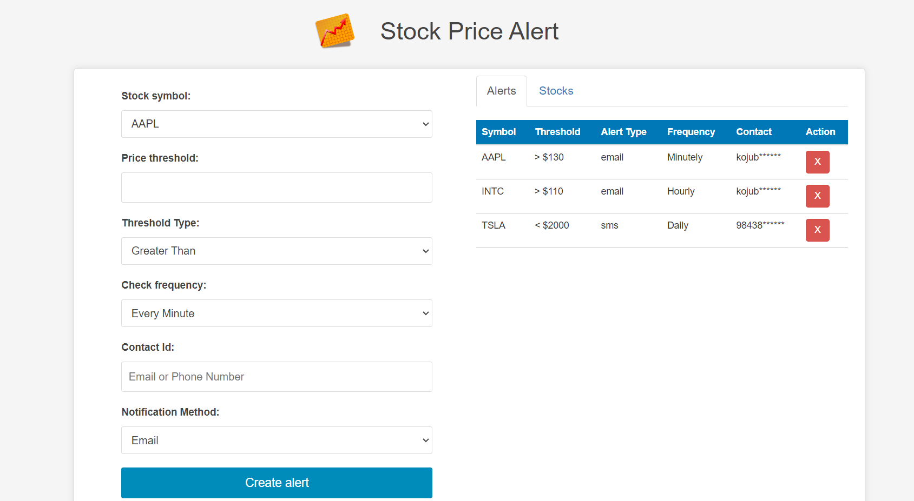
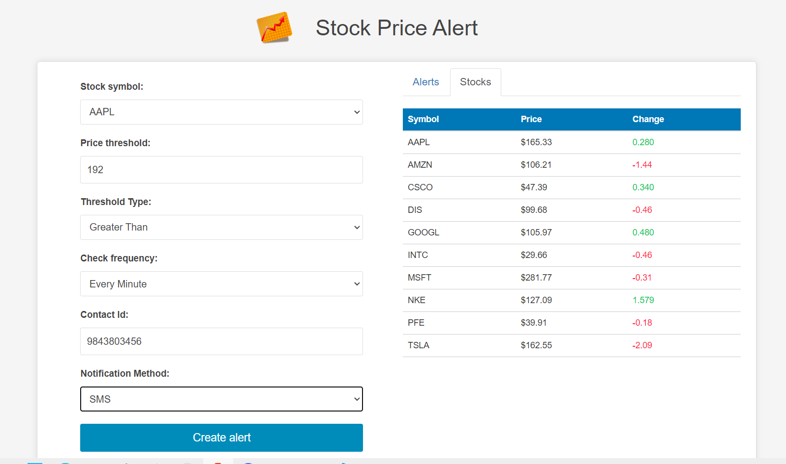

# Stock Alert

Stock Alert is a web application built using React that allows users to set alerts for stock prices and receive notifications when the prices reach a certain threshold. The application uses real-time stock prices and allows users to set the frequency of the alerts.

## Use case

Stock Alert is useful for individuals who are interested in investing in stocks and want to stay informed about the price fluctuations. The application allows users to set alerts for specific stocks and receive notifications when the prices of those stocks reach a certain threshold. This makes it easier for users to keep track of their investments and make informed decisions about buying or selling stocks.

## Screenshots

## Installation

To run Stock Alert locally, follow these steps:

1. Clone the repository: `git clone git@github.com:Bishadkoju/StockAlert.git`
2. Navigate to cloned direcotry : `cd StockAlert/Frontend`
3. Install the dependencies: `npm install`
4. Start the development server: `npm start`

## Components
- App
  - AlertForm
  - TabView
    - Alerts
    - Stocks

### Tab View

The Tab View component is responsible for rendering the tabs for the Alerts and Stocks components. It includes a tab navigation bar and a tab content area where the components are displayed.
### Alert Form

The Alert Form component allows users to create a new alert for a stock. It includes fields for the stock symbol, threshold price, notification method, and frequency of alerts. Once the form is submitted, a new alert is added to the list of alerts in the Alerts tab.

### Alerts

The Alerts component displays a table of all the alerts that the user has created. It includes information about the stock symbol, threshold price, notification method, frequency of alerts, and the contact information for the user. Users can delete alerts by clicking the "X" button next to each alert.

### Stocks

The Stocks component displays a table of current stock prices for the symbols that the user has set up alerts for. It includes information about the stock symbol, current price, and change in price since the previous day. The change in price is displayed in green if it's positive and red if it's negative.

## Contributing

Contributions are welcome! If you'd like to contribute to this project, please open an issue or submit a pull request.

## License

This project is licensed under the MIT License. See the `LICENSE` file for more information.
